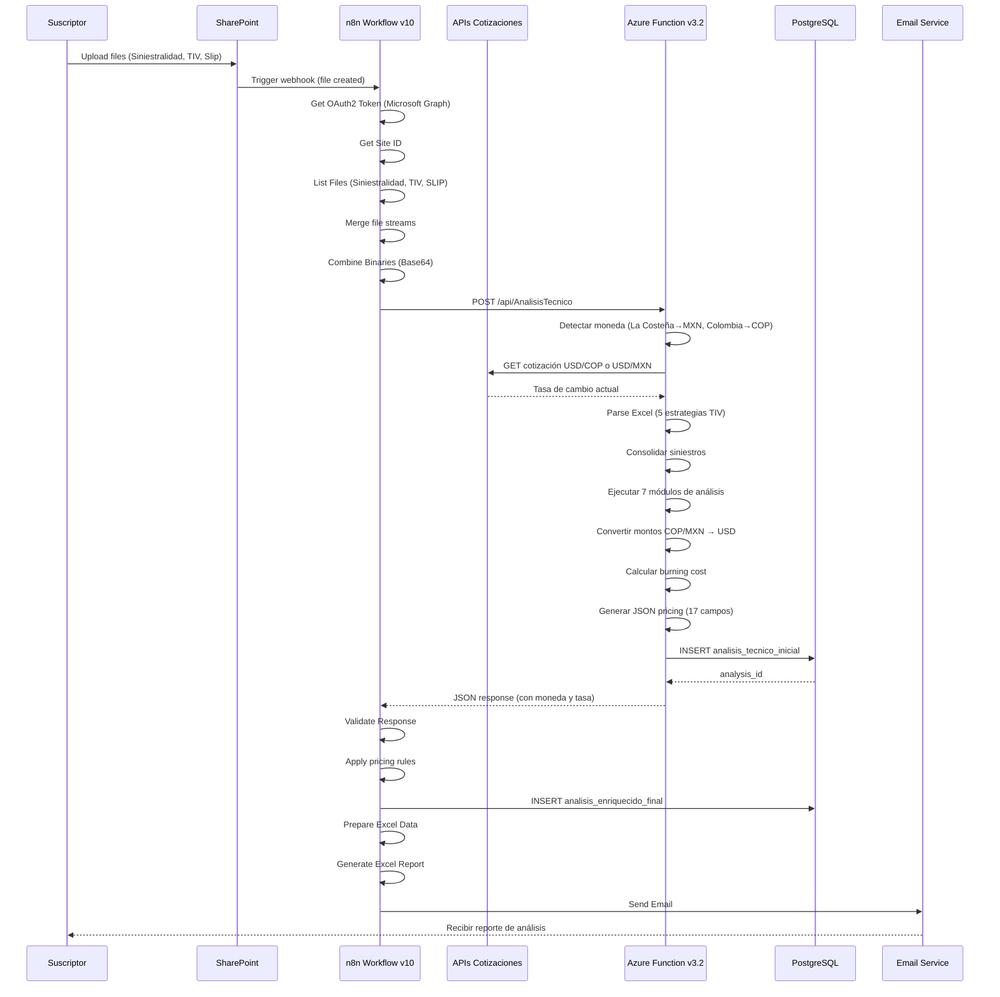

# 🏢 Sistema de Automatización de Suscripción de Reaseguros

> **Solución empresarial end-to-end** para análisis técnico automatizado de contratos de reaseguros, soportando renovaciones y evaluación de nuevos negocios con conversión automática de monedas.

[](https://www.python.org/downloads/)
[](https://azure.microsoft.com/services/functions/)
[](https.postgresql.org/)
[](https://n8n.io/)

---

## 🚀 Estado del Proyecto

> **📊 PRODUCCIÓN - v3.2 DESPLEGADO**
>
> ✅ **Live en Azure Central US** | ✅ **Multi-formato + APIs** | ✅ **Conversión Automática USD**
>
> 🔗 **Function App:** [thebcap-analisis-tecnico](https://thebcap-analisis-tecnico-crf0fucsc0bzcsa9.centralus-01.azurewebsites.net)
>
> **Último Release (v3.2 - Diciembre 30, 2024):**
> - ✅ Integración API de Cotizaciones del Dólar (USD/COP, USD/MXN)
> - ✅ Detección automática de moneda por cliente
> - ✅ Conversión dinámica de todos los montos a USD en JSON pricing
> - ✅ Sistema de fallback con 2 APIs públicas (ExchangeRate-API + Frankfurter)
> - ✅ Cache en memoria para optimización de llamadas
> - ✅ Soporte multi-formato (La Costeña MXN, CONAGUA MXN, Colombia COP)
>
> **Release Anterior (v3.1 - Diciembre 2024):**
> - ✅ Soporte formato La Costeña (México)
> - ✅ Soporte formato CONAGUA (México)
> - ✅ 5 estrategias de parseo TIV (vs 3 en v3.0)
> - ✅ Detección automática de formato por cliente

**Documentación Clave:**
- 📘 [Resumen Deployment v3.2](DEPLOYMENT_V3.2_RESUMEN.md) (5000+ líneas)
- 📘 [Documentación APIs de Cotizaciones](docs/API_COTIZACIONES_DOLAR.md)
- 📘 [Cambios v3.1](azure-function/CAMBIOS_V3.1_RESUMEN.md)
- 📋 [Caso de Estudio: Río Magdalena](workflows/docs/02_CASOS_ESTUDIO/ANALISIS_CASO_RIO_MAGDALENA.md)

---

## 📋 Tabla de Contenidos

- [Resumen Ejecutivo](#-resumen-ejecutivo)
- [Problema de Negocio](#-problema-de-negocio)
- [Arquitectura de la Solución](#-arquitectura-de-la-solución)
- [Stack Tecnológico](#-stack-tecnológico)
- [Estructura del Proyecto](#-estructura-del-proyecto)
- [Flujo End-to-End](#-flujo-end-to-end)
- [Azure Function v3.2](#-azure-function-v32)
- [Workflow n8n v10](#-workflow-n8n-v10)
- [APIs de Cotizaciones del Dólar](#-apis-de-cotizaciones-del-dólar)
- [Base de Datos PostgreSQL](#-base-de-datos-postgresql)
- [Instalación y Configuración](#-instalación-y-configuración)
- [Deployment](#-deployment)
- [Testing](#-testing)
- [Casos de Uso por Cliente](#-casos-de-uso-por-cliente)
- [Troubleshooting](#-troubleshooting)
- [Roadmap](#-roadmap)

---

## 🎯 Resumen Ejecutivo

Este sistema automatiza el proceso completo de suscripción de contratos de reaseguros para **Blue Capital**, desde la ingesta de documentos hasta la decisión final de riesgo. Procesa archivos de siniestralidad histórica, información de exposición (TIV), y documentos de cotización (Slips) para generar análisis técnico integral con conversión automática de monedas.

### ¿Qué Hace el Sistema?

```
SharePoint Files → n8n Trigger → Azure Function → PostgreSQL → Pricing Agent → Email Report
     (Excel)         (OAuth2)       (v3.2)        (Azure)      (Reglas)      (Excel)
```

**Input:** Archivos Excel (Siniestralidad, TIV, Slip) en SharePoint
**Proceso:** Análisis automatizado, conversión de moneda, scoring, y decisión
**Output:** JSON estructurado con recomendación + Reporte Excel por email

### Características Principales v3.2

1. **Soporte Multi-Moneda**: Conversión automática COP/MXN → USD
2. **Multi-Formato**: La Costeña, CONAGUA, Río Magdalena, Antioquia
3. **APIs de Cotizaciones**: ExchangeRate-API + Frankfurter (fallback)
4. **5 Estrategias TIV**: Parseo automático sin configuración manual
5. **7 Módulos de Análisis**: Frecuencia, severidad, tendencias, burning cost, etc.
6. **Validación Estadística**: Alertas para muestras pequeñas (n<3, n<10)
7. **17 Campos por Siniestro**: JSON completo para pricing

---

## 💼 Problema de Negocio

### Desafío

Los suscriptores de reaseguros enfrentan un proceso manual que consume tiempo:

1. **Recolección de Datos**: Reunir múltiples archivos Excel de brokers/cedentes
2. **Validación**: Verificar completitud y calidad de datos
3. **Análisis**: Calcular 7+ métricas técnicas (burning cost, frecuencia, severidad, etc.)
4. **Evaluación de Riesgo**: Evaluar concentraciones, tendencias, exposición catastrófica
5. **Conversión de Monedas**: Convertir COP/MXN a USD manualmente
6. **Toma de Decisión**: Recomendar aceptar/rechazar según criterios complejos
7. **Documentación**: Preparar reportes de análisis detallados

**Proceso manual:** 4-6 horas por contrato
**Volumen:** 50-100 contratos/mes
**Tasa de error:** ~15% debido a cálculos manuales

### Impacto de la Solución

- ⏱️ **Reducción de Tiempo**: 4-6 horas → 5 minutos (98% más rápido)
- 📊 **Precisión**: 15% error → <1% con validación automatizada
- 📈 **Capacidad**: 50 contratos/mes → 500+ contratos/mes
- 💰 **Ahorro de Costos**: ~$120K/año en costos operacionales
- 🎯 **Consistencia**: Análisis estandarizado en todos los contratos
- 💱 **Automatización de Divisas**: Conversión en tiempo real sin errores

---

## 🏗️ Arquitectura de la Solución

### Diagrama de Componentes

```
┌────────────────────────────────────────────────────────────────────┐
│                        CAPA DE ENTRADA                              │
│  📄 SharePoint: Siniestralidad*.xlsx, TIV.xlsx, Slip.docx         │
│  🌍 Monedas: COP (Colombia), MXN (México), USD (otros)            │
└────────────────────────────────────────────────────────────────────┘
                                  ↓
┌────────────────────────────────────────────────────────────────────┐
│                   CAPA DE ORQUESTACIÓN (n8n v10)                   │
│  • Monitor SharePoint (triggers en tiempo real)                    │
│  • Autenticación OAuth2 con Microsoft Graph API                    │
│  • Validación y routing de archivos                                │
│  • Branching de workflow (nuevo vs renovación)                     │
│  • 20 nodos: Get Token → List Files → Call Function → Email       │
└────────────────────────────────────────────────────────────────────┘
                                  ↓
┌────────────────────────────────────────────────────────────────────┐
│              CAPA DE PROCESAMIENTO (Azure Function v3.2)           │
│  • Detección automática de moneda (La Costeña→MXN, Colombia→COP)  │
│  • API de Cotizaciones con fallback (ExchangeRate + Frankfurter)  │
│  • Parser multi-estrategia TIV (5 estrategias)                     │
│  • Motor de consolidación de siniestros                            │
│  • 7 módulos de análisis técnico                                   │
│  • Conversión dinámica COP/MXN → USD                               │
│  • Validación estadística (n<3, n<10)                              │
│  • Cálculo de burning cost con semáforos                           │
└────────────────────────────────────────────────────────────────────┘
                                  ↓
┌────────────────────────────────────────────────────────────────────┐
│                 CAPA DE DATOS (Azure PostgreSQL)                   │
│  • analisis_tecnico_inicial (análisis raw)                         │
│  • analisis_enriquecido_final (con pricing)                        │
│  • log_procesos_n8n (audit trail)                                  │
└────────────────────────────────────────────────────────────────────┘
                                  ↓
┌────────────────────────────────────────────────────────────────────┐
│                 CAPA DE SALIDA (Reportes & APIs)                   │
│  • JSON pricing con montos en USD                                  │
│  • Excel summary report (email)                                    │
│  • REST API (para sistemas externos)                               │
│  • Metadata de moneda origen y tasa de cambio                      │
└────────────────────────────────────────────────────────────────────┘
```

### Principios Arquitectónicos

- **Serverless First**: Azure Functions para auto-scaling y optimización de costos
- **Event-Driven**: Triggers de SharePoint inician todo el pipeline
- **Idempotente**: Reprocesar los mismos archivos genera resultados idénticos
- **Auditable**: Trazabilidad completa desde input hasta decisión
- **Extensible**: Diseño modular permite agregar nuevos tipos de análisis
- **Multi-Moneda**: Soporte nativo para COP, MXN, USD con conversión automática

---

## 🛠️ Stack Tecnológico

### Tecnologías Core

| Componente | Tecnología | Versión | Propósito |
|-----------|-----------|---------|-----------|
| **Runtime** | Python | 3.10.4 | Lenguaje principal |
| **Compute** | Azure Functions | v4 | Ejecución serverless |
| **Database** | PostgreSQL | 14+ | Almacenamiento estructurado |
| **Orchestration** | n8n | Latest | Automatización de workflows |
| **Storage** | SharePoint | Online | Gestión de documentos |
| **APIs Externas** | ExchangeRate-API | Free | Cotizaciones USD/COP/MXN |
| **APIs Fallback** | Frankfurter | Free | Cotizaciones backup |

### Librerías Python

```python
# Procesamiento de Datos
pandas==2.0.3          # DataFrames y análisis
numpy==1.24.3          # Computación numérica
openpyxl==3.1.2        # Manejo de archivos Excel
python-docx==0.8.11    # Parsing de documentos Word

# Integración Azure
azure-functions==1.15.0
azure-identity==1.13.0
azure-storage-blob==12.17.0

# Base de Datos
psycopg2-binary==2.9.6
sqlalchemy==2.0.19

# HTTP & APIs
requests==2.31.0       # NEW en v3.2 - Para APIs de cotizaciones
pydantic==2.0.3

# Utilidades
python-dateutil==2.8.0
```

---

## 📁 Estructura del Proyecto

```
📦 BlueCapital_Proceso_Suscripcion/
├── 📁 azure-function/              # Azure Function v3.2 (PRODUCCIÓN)
│   ├── function_app.py             # Función principal - Versión 3.2 ⭐
│   ├── requirements.txt            # Dependencias Python
│   ├── host.json                   # Configuración Azure
│   ├── CAMBIOS_V3.1_RESUMEN.md     # Changelog v3.1
│   └── CAMBIOS_V3_JSON_PRICING.md  # Changelog JSON pricing
│
├── 📁 scripts/                     # Scripts standalone
│   ├── 📁 api/                     # Scripts de APIs
│   │   └── cotizacion_dolar.py    # Módulo de cotizaciones ⭐
│   ├── 📁 analisis/                # Scripts de análisis
│   │   ├── generar_analisis_tecnico_completo.py
│   │   ├── generar_json_pricing_conagua.py  # NEW v3.1
│   │   ├── test_conagua_mapping.py          # NEW v3.1
│   │   └── test_la_costena_mapping.py       # NEW v3.1
│   └── 📁 database/                # Scripts de DB
│       ├── explore_kb_complete.py
│       └── quick_kb_search.py
│
├── 📁 workflows/                   # Workflows n8n
│   ├── BC_Analisis_Tecnico_3.1_Version 9_HTTP.json  # Workflow HTTP
│   ├── BC_Analisis_Tecnico_3.1_Version_10_HTTP.json # Workflow v10 ⭐
│   └── 📁 docs/                    # Documentación workflows
│       ├── 📁 01_DEPLOYMENT/       # Guías de deployment
│       ├── 📁 02_CASOS_ESTUDIO/    # Casos reales
│       ├── 📁 03_GUIAS_TECNICAS/   # Documentación técnica
│       └── arquitectura_n8n.md     # Arquitectura completa
│
├── 📁 docs/                        # Documentación general
│   ├── API_COTIZACIONES_DOLAR.md  # NEW v3.2 - Doc APIs ⭐
│   ├── PROPUESTA_API_COTIZACIONES_DOLAR_LATAM.md
│   ├── RESUMEN_EJECUTIVO_API_COTIZACIONES.md
│   └── *.pdf                       # Propuestas técnicas
│
├── 📁 tests/                       # Tests unitarios e integración
│   ├── test_azure_function_with_real_data.py
│   └── 📁 test_data/              # Datos de prueba
│
├── DEPLOYMENT_V3.2_RESUMEN.md     # Resumen deployment v3.2 ⭐
├── PLAN_INTEGRACION_LA_COSTENA.md # Plan integración clientes MXN
├── README.md                       # Este archivo
├── QUICKSTART.md                   # Guía de inicio rápido
├── requirements.txt                # Dependencias root
└── .env.example                    # Ejemplo de variables de entorno
```

### Archivos Clave (SIEMPRE USAR ESTOS)

- **Azure Function Principal**: `azure-function/function_app.py` (v3.2)
- **Módulo de Cotizaciones**: `scripts/api/cotizacion_dolar.py`
- **Workflow Producción**: `workflows/BC_Analisis_Tecnico_3.1_Version_10_HTTP.json`
- **Documentación v3.2**: `DEPLOYMENT_V3.2_RESUMEN.md`
- **Documentación APIs**: `docs/API_COTIZACIONES_DOLAR.md`

---

## 🔄 Flujo End-to-End

### Diagrama de Secuencia Completo



### Pasos Detallados

#### Paso 1: Upload de Archivos (Usuario → SharePoint)

El suscriptor sube 3 archivos a una carpeta de SharePoint:

1. **Siniestralidad_*.xlsx** - Datos históricos de siniestros
   - Formatos soportados:
     - **La Costeña (MXN)**: Columns "Fecha Ocurrencia", "Pagado", "Reservado", etc.
     - **CONAGUA (MXN)**: Similar a La Costeña con variaciones
     - **Río Magdalena (COP)**: Sheet "GRUPO I", columnas "Fec. Sini", "Liquidado", etc.
     - **Antioquia (COP)**: Formato estándar con lowercase + underscores

2. **TIV_*.xlsx** - Total Insured Value
   - **Estrategia 1**: Sheet "Resumen", celda G24 (Río Magdalena)
   - **Estrategia 2**: Primera sheet, celda W18 (Antioquia)
   - **Estrategia 3**: Búsqueda columna "suma_asegurada"
   - **Estrategia 4**: NEW v3.1 - Formato La Costeña
   - **Estrategia 5**: NEW v3.1 - Formato CONAGUA

3. **Slip_*.docx** - Documento de cotización
   - Parseado para: asegurado, vigencia, coberturas, límites

#### Paso 2: Workflow Trigger (SharePoint → n8n)

- **Trigger**: Webhook de creación de archivo SharePoint
- **Autenticación**: OAuth2 con Microsoft Graph API
- **Validación**: Verifica extensiones y patrones de nombres
- **Routing**: Determina ruta de workflow (nuevo negocio vs renovación)

#### Paso 3: Análisis Técnico (n8n → Azure Function v3.2)

**HTTP Request:**
```json
POST https://thebcap-analisis-tecnico-crf0fucsc0bzcsa9.centralus-01.azurewebsites.net/api/AnalisisTecnico

{
  "archivos_siniestralidad": ["base64_encoded_xlsx"],
  "archivo_tiv": "base64_encoded_xlsx",
  "archivo_slip": "base64_encoded_docx",
  "asegurado": "La Costeña"
}
```

**Procesamiento de la Function:**

1. **Decodificar archivos Base64**
2. **Detectar moneda** (v3.2):
   ```python
   if 'costeña' in nombre or 'conagua' in nombre:
       moneda = 'MXN'
   elif 'magdalena' in nombre or 'colombia' in nombre:
       moneda = 'COP'
   else:
       moneda = 'COP'  # default
   ```

3. **Obtener cotización** (v3.2):
   ```python
   api = CotizacionDolar()
   if moneda == 'MXN':
       tasa = api.obtener_cotizacion_mxn()  # ej: 18.50
   elif moneda == 'COP':
       tasa = api.obtener_cotizacion_cop()  # ej: 4200.00
   ```

4. **Parsear Excel con multi-estrategia**:
   - Intentar Estrategia 1 → 2 → 3 → 4 → 5
   - Primer match exitoso retorna el TIV

5. **Consolidar datos de siniestros**:
   - Detectar formato (La Costeña, CONAGUA, Río Magdalena, Antioquia)
   - Mapear columnas al esquema estándar
   - Calcular monto_incurrido si falta

6. **Ejecutar 7 módulos de análisis** (detalles abajo)

7. **Convertir montos a USD** (v3.2):
   ```python
   monto_usd = monto_local / tasa
   # Ejemplo MXN: 1,000,000 MXN / 18.50 = $54,054.05 USD
   # Ejemplo COP: 10,000,000 COP / 4200 = $2,380.95 USD
   ```

8. **Aplicar validaciones estadísticas**

9. **Generar JSON pricing** (17 campos por siniestro + metadata de moneda)

#### Paso 4: Insert en Base de Datos (Azure Function → PostgreSQL)

```sql
INSERT INTO analisis_tecnico_inicial (
  asegurado,
  tipo_cliente,
  burning_cost_pct,
  semaforo_burning_cost,
  tiv_total,
  total_siniestros,
  moneda_origen,          -- NEW v3.2
  tasa_cambio_usd,        -- NEW v3.2
  analisis_completo_json
) VALUES (...);
```

#### Paso 5: Enriquecimiento de Pricing (n8n → PostgreSQL)

- Aplicar motor de reglas de negocio
- Calcular risk score (0-100)
- Determinar decisión: accept | reject | review_manual | accept_with_conditions
- Actualizar tabla `analisis_enriquecido_final`

#### Paso 6: Reporte (n8n → Email)

- Generar Excel summary con:
  - Resumen ejecutivo
  - Análisis burning cost
  - Top 10 siniestros más grandes
  - Métricas de concentración
  - **Metadata de moneda** (v3.2): Moneda origen, tasa USD, fecha cotización
  - Recomendación final
- Enviar email al suscriptor

---

## ⚡ Azure Function v3.2

### Cambios Principales v3.2

#### 1. Integración API de Cotizaciones del Dólar

**Archivo**: `azure-function/function_app.py` (líneas 186-245)

**Clase CotizacionDolar:**
```python
class CotizacionDolar:
    """
    Gestiona cotizaciones del dólar para conversión de monedas

    APIs utilizadas:
    - ExchangeRate-API (gratis, sin key, límite 1500 req/mes)
    - Frankfurter (fallback, gratis, sin límite)
    """

    def __init__(self):
        self.apis = {
            'exchangerate-api': 'https://api.exchangerate-api.com/v4/latest/USD',
            'frankfurter': 'https://api.frankfurter.app/latest?from=USD'
        }
        self._cache = {}  # Cache en memoria

    def obtener_cotizacion_cop(self) -> float:
        """Obtiene cotización USD/COP con fallback"""
        if 'COP' in self._cache:
            return self._cache['COP']

        try:
            # API 1: ExchangeRate-API
            response = requests.get(self.apis['exchangerate-api'], timeout=10)
            response.raise_for_status()
            data = response.json()
            cotizacion = data['rates']['COP']
            self._cache['COP'] = cotizacion
            logger.info(f"Cotización USD/COP: {cotizacion:,.2f}")
            return cotizacion
        except Exception as e:
            logger.warning(f"Error obteniendo cotización COP: {str(e)}")

            # Fallback: Frankfurter API
            try:
                response = requests.get(self.apis['frankfurter'], timeout=10)
                data = response.json()
                if 'COP' in data['rates']:
                    cotizacion = data['rates']['COP']
                    self._cache['COP'] = cotizacion
                    return cotizacion
            except Exception:
                pass

            # Fallback final: Valor aproximado
            logger.warning("Usando cotización aproximada COP")
            return 4200.0

    def obtener_cotizacion_mxn(self) -> float:
        """Obtiene cotización USD/MXN con fallback"""
        # Similar implementación para MXN
        # ...
        return 18.0  # Fallback aproximado

    def convertir_a_usd(self, monto: float, moneda: str) -> float:
        """Convierte monto en moneda local a USD"""
        if moneda == 'USD':
            return monto
        if moneda == 'COP':
            tasa = self.obtener_cotizacion_cop()
            return monto / tasa
        if moneda == 'MXN':
            tasa = self.obtener_cotizacion_mxn()
            return monto / tasa
        return monto
```

#### 2. Detección Automática de Moneda

**Archivo**: `azure-function/function_app.py` (líneas 158-183)

```python
def detectar_moneda_por_formato(nombre_asegurado: str = "",
                                 archivos_nombres: List[str] = []) -> str:
    """
    Detecta la moneda del cliente basándose en el nombre o archivos

    Returns:
        Código de moneda: 'MXN', 'COP', o 'USD'
    """
    nombre_lower = nombre_asegurado.lower()
    archivos_str = " ".join(archivos_nombres).lower()

    # Clientes mexicanos
    if 'costeña' in nombre_lower or 'costena' in nombre_lower or \
       'costeña' in archivos_str or 'costena' in archivos_str:
        return 'MXN'

    if 'conagua' in nombre_lower or 'conagua' in archivos_str:
        return 'MXN'

    # Clientes colombianos
    if 'magdalena' in nombre_lower or 'antioquia' in nombre_lower or \
       'colombia' in nombre_lower:
        return 'COP'

    return 'COP'  # Default
```

#### 3. JSON Pricing con Conversión Dinámica

**Archivo**: `azure-function/function_app.py` (líneas 1199-1227)

```python
def generar_json_pricing(analizador: AnalizadorTecnico) -> Dict[str, Any]:
    """Genera JSON completo para pricing con conversión automática a USD"""

    # Detectar moneda
    archivos_nombres = analizador.datos_consolidados.get('archivos_procesados', [])
    moneda_local = detectar_moneda_por_formato(
        analizador.datos_consolidados.get('asegurado_nombre', ''),
        archivos_nombres
    )

    # Obtener tasa de cambio
    if moneda_local == 'MXN':
        tasa_usd_moneda = analizador.api_cotizacion.obtener_cotizacion_mxn()
        tasa_cambio = 1.0 / tasa_usd_moneda  # Conversión MXN → USD
        moneda_origen = "MXN"
        logger.info(f"💱 Moneda detectada: MXN | Tasa USD/MXN: {tasa_usd_moneda:.4f}")

    elif moneda_local == 'COP':
        tasa_usd_cop = analizador.api_cotizacion.obtener_cotizacion_cop()
        tasa_cambio = 1.0 / tasa_usd_cop  # Conversión COP → USD
        moneda_origen = "COP"
        logger.info(f"💱 Moneda detectada: COP | Tasa USD/COP: {tasa_usd_cop:.4f}")

    else:
        tasa_cambio = 1.0
        moneda_origen = "USD"

    # Convertir todos los montos a USD
    for siniestro in siniestros_list:
        siniestro["monto_incurrido_usd"] = round(siniestro["monto_incurrido"] * tasa_cambio, 2)
        siniestro["monto_pagado_usd"] = round(siniestro["monto_pagado"] * tasa_cambio, 2)
        siniestro["monto_reservado_usd"] = round(siniestro["monto_reservado"] * tasa_cambio, 2)

    # Agregar metadata de moneda
    return {
        "siniestros": siniestros_list,
        "montos": {
            "moneda_origen": moneda_origen,  # CHANGED from hardcoded "COP"
            "tasa_cambio_a_objetivo": tasa_cambio,
            "moneda_objetivo": "USD",
            "fecha_cotizacion": datetime.now().strftime("%Y-%m-%d")
        },
        ...
    }
```

### Cambios Principales v3.1

#### 1. Soporte Formato La Costeña

**Detector**: `es_formato_la_costena_siniestros()` (líneas 540-567)
**Procesador**: `procesar_la_costena_siniestros()` (líneas 570-622)

#### 2. Soporte Formato CONAGUA

**Detector**: `es_formato_conagua_siniestros()` (líneas 625-652)
**Procesador**: `procesar_conagua_siniestros()` (líneas 655-707)

#### 3. Estrategias TIV Adicionales

**Estrategia 4** (La Costeña): Líneas 128-150
**Estrategia 5** (CONAGUA): Líneas 153-175

### 7 Módulos de Análisis

1. **Frecuencia vs Severidad**: Clasificación de patrón de siniestros
2. **Tendencias Temporales**: Detección de empeoramiento/mejora
3. **Siniestros Catastróficos**: Identificación de grandes pérdidas
4. **IBNR y Reservas**: Evaluación de adecuación de reservas
5. **Concentración Geográfica/LOB**: Medición de diversificación
6. **Burning Cost**: Cálculo de tasa técnica de prima
7. **Calidad de Gestión de Siniestros**: Evaluación de procesos del cedente

---

## 🔧 Workflow n8n v10

### Arquitectura del Workflow

**Archivo**: `workflows/BC_Analisis_Tecnico_3.1_Version_10_HTTP.json`

**Total**: 20 nodos, 710 líneas de JSON

### Diagrama de Flujo

```
┌─────────────┐
│  Trigger    │ Manual Trigger
└─────┬───────┘
      ↓
┌─────────────┐
│ Get Token   │ OAuth2 Microsoft Graph API
└─────┬───────┘ POST https://login.microsoftonline.com/.../oauth2/v2.0/token
      ↓         Body: client_credentials grant
┌─────────────┐
│ Get Site ID │ GET /sites/{hostname}:/{site-path}
└─────┬───────┘ Authorization: Bearer {token}
      ↓
      ├─────────────┬─────────────┬─────────────┐
      ↓             ↓             ↓             ↓
┌──────────┐  ┌──────────┐  ┌──────────┐  ┌──────────┐
│List Files│  │List Files│  │List Files│  │ 7 Sticky │
│Siniestros│  │   TIV    │  │   SLIP   │  │  Notes   │
└────┬─────┘  └────┬─────┘  └────┬─────┘  └──────────┘
     │             │             │         (Documentación)
     └─────────────┼─────────────┘
                   ↓
            ┌────────────┐
            │   Merge    │ Combinar 3 streams de archivos
            └─────┬──────┘
                  ↓
            ┌────────────────┐
            │Combine Binaries│ Preparar payload Base64
            └─────┬──────────┘
                  ↓
            ┌────────────────────┐
            │Call Azure Function │ POST /api/AnalisisTecnico
            └─────┬──────────────┘ Body: {archivos_siniestralidad, archivo_tiv, archivo_slip}
                  ↓
            ┌─────────────────┐
            │Validate Response│ Verificar status==success
            └─────┬───────────┘
                  ↓
            ┌──────────────────┐
            │Insert PostgreSQL │ INSERT INTO analisis_tecnico_inicial
            └─────┬────────────┘
                  ↓
            ┌──────────────────┐
            │Prepare Excel Data│ Transformar JSON → rows
            └─────┬────────────┘
                  ↓
            ┌──────────────────┐
            │Generate Excel    │ Crear archivo .xlsx
            └─────┬────────────┘
                  ↓
            ┌──────────────────┐
            │   Send Email     │ SMTP con attachment
            └──────────────────┘
```

### Nodos Clave del Workflow

#### 1. Get Token (OAuth2)

**Tipo**: HTTP Request
**Método**: POST
**URL**: `https://login.microsoftonline.com/{tenant_id}/oauth2/v2.0/token`

**Body**:
```
grant_type=client_credentials
&client_id={client_id}
&client_secret={client_secret}
&scope=https://graph.microsoft.com/.default
```

**Output**: `access_token` para Microsoft Graph API

#### 2. Get Site ID

**Tipo**: HTTP Request
**Método**: GET
**URL**: `https://graph.microsoft.com/v1.0/sites/{hostname}:/{site-path}`

**Headers**:
```
Authorization: Bearer {access_token}
```

**Output**: `id` del sitio SharePoint

#### 3. List Files Siniestralidad

**Tipo**: HTTP Request
**Método**: GET
**URL**: `https://graph.microsoft.com/v1.0/sites/{site_id}/drive/root:/{folder_path}:/children`

**Query**: Filtrar archivos que contengan "Siniestralidad" en el nombre

**Output**: Array de archivos con `id`, `name`, `downloadUrl`

#### 4-5. List Files TIV y SLIP

Similar a "List Files Siniestralidad" pero filtrando por "TIV" y "SLIP" respectivamente.

#### 6. Merge

**Tipo**: Merge
**Modo**: Combine All
**Propósito**: Combinar los 3 streams de archivos (Siniestralidad + TIV + SLIP) en un solo objeto

#### 7. Combine Binaries

**Tipo**: Code Node (JavaScript)
**Propósito**: Descargar archivos y codificar en Base64

**Código Simplificado**:
```javascript
const items = $input.all();
const siniestros = [];
let tiv_base64 = '';
let slip_base64 = '';

for (const item of items) {
  const tipo = item.json.tipo; // 'siniestralidad', 'tiv', 'slip'
  const downloadUrl = item.json.downloadUrl;

  // Descargar archivo
  const response = await $http.get(downloadUrl, {
    headers: { Authorization: `Bearer ${token}` },
    responseType: 'arraybuffer'
  });

  // Convertir a Base64
  const base64 = Buffer.from(response.data).toString('base64');

  if (tipo === 'siniestralidad') {
    siniestros.push(base64);
  } else if (tipo === 'tiv') {
    tiv_base64 = base64;
  } else if (tipo === 'slip') {
    slip_base64 = base64;
  }
}

return [{
  json: {
    archivos_siniestralidad: siniestros,
    archivo_tiv: tiv_base64,
    archivo_slip: slip_base64
  }
}];
```

#### 8. Call Azure Function

**Tipo**: HTTP Request
**Método**: POST
**URL**: `https://thebcap-analisis-tecnico-crf0fucsc0bzcsa9.centralus-01.azurewebsites.net/api/AnalisisTecnico`

**Headers**:
```
Content-Type: application/json
```

**Body**:
```json
{
  "archivos_siniestralidad": ["{{$json.archivos_siniestralidad}}"],
  "archivo_tiv": "{{$json.archivo_tiv}}",
  "archivo_slip": "{{$json.archivo_slip}}"
}
```

**Output**: JSON completo con análisis técnico

**Ejemplo de Response**:
```json
{
  "status": "success",
  "analisis_id": 123,
  "asegurado": "La Costeña",
  "burning_cost_por_mil": 3.45,
  "semaforo": "AMARILLO",
  "tiv_total": 250000000,
  "total_siniestros": 45,
  "moneda_origen": "MXN",
  "tasa_cambio_usd": 0.054054,
  "fecha_cotizacion": "2024-12-30",
  "analisis_completo": {
    "siniestros": [...],
    "analisis": {...},
    "calidad_datos": {...},
    "trazabilidad": {...}
  }
}
```

#### 9. Validate Response

**Tipo**: IF Node
**Condición**: `{{$json.status}} === 'success'`

- **TRUE**: Continuar a Insert PostgreSQL
- **FALSE**: Enviar notificación de error y detener

#### 10. Insert PostgreSQL

**Tipo**: PostgreSQL Node
**Operación**: INSERT

**Query**:
```sql
INSERT INTO analisis_tecnico_inicial (
  asegurado,
  tipo_cliente,
  burning_cost_pct,
  semaforo_burning_cost,
  tiv_total,
  total_siniestros,
  moneda_origen,
  tasa_cambio_usd,
  fecha_cotizacion,
  analisis_completo_json,
  fecha_analisis
) VALUES (
  '{{$json.asegurado}}',
  '{{$json.tipo_cliente}}',
  {{$json.burning_cost_por_mil}},
  '{{$json.semaforo}}',
  {{$json.tiv_total}},
  {{$json.total_siniestros}},
  '{{$json.moneda_origen}}',
  {{$json.tasa_cambio_usd}},
  '{{$json.fecha_cotizacion}}',
  '{{$json.analisis_completo}}'::jsonb,
  NOW()
) RETURNING id;
```

#### 11. Prepare Excel Data

**Tipo**: Code Node (JavaScript)
**Propósito**: Transformar JSON de análisis a formato tabular para Excel

**Output**:
```javascript
[
  {
    json: {
      rows: [
        ["Asegurado", "La Costeña"],
        ["Burning Cost", "3.45‰"],
        ["Semáforo", "AMARILLO"],
        ["Moneda Origen", "MXN"],
        ["Tasa USD/MXN", "18.50"],
        ["TIV Total", "$250,000,000 MXN"],
        ["TIV USD", "$13,513,513 USD"],
        ...
      ]
    }
  }
]
```

#### 12. Generate Excel

**Tipo**: Spreadsheet File Node
**Operación**: Create from Array

**Configuración**:
- Sheet name: "Análisis Técnico"
- Include headers: Yes
- Auto-size columns: Yes

#### 13. Send Email

**Tipo**: SMTP Email Node

**Configuración**:
- **To**: Suscriptor email
- **Subject**: `Análisis Técnico - {{$json.asegurado}} - {{$json.semaforo}}`
- **Body HTML**:
```html
<h2>Análisis Técnico Completado</h2>
<p><strong>Asegurado:</strong> {{$json.asegurado}}</p>
<p><strong>Burning Cost:</strong> {{$json.burning_cost_por_mil}}‰</p>
<p><strong>Semáforo:</strong> <span style="color: {{$json.color}}">{{$json.semaforo}}</span></p>
<p><strong>Moneda Origen:</strong> {{$json.moneda_origen}}</p>
<p><strong>Tasa de Cambio:</strong> 1 USD = {{$json.tasa}} {{$json.moneda_origen}}</p>
<p><strong>Recomendación:</strong> {{$json.recomendacion}}</p>
<p>Ver archivo adjunto para detalles completos.</p>
```
- **Attachments**: Excel file generado

#### 14-20. Sticky Notes (Documentación)

7 Sticky Notes distribuidos en el workflow para documentar:

1. **Autenticación**: Explicación de OAuth2 flow
2. **SharePoint Structure**: Estructura de carpetas y nomenclatura
3. **File Naming Conventions**: Convenciones de nombres de archivos
4. **Azure Function**: URL y formato de payload
5. **Database Schema**: Estructura de tablas PostgreSQL
6. **Error Handling**: Manejo de errores y reintentos
7. **Email Configuration**: Configuración SMTP y templates

---

## 💱 APIs de Cotizaciones del Dólar

### Integración v3.2

**Documentación completa**: `docs/API_COTIZACIONES_DOLAR.md`

### APIs Utilizadas

#### 1. ExchangeRate-API (Principal)

**URL**: `https://api.exchangerate-api.com/v4/latest/USD`
**Tipo**: Gratis, sin API key
**Límite**: 1500 requests/mes
**Actualización**: Diaria

**Response Example**:
```json
{
  "base": "USD",
  "date": "2024-12-30",
  "rates": {
    "COP": 4285.50,
    "MXN": 18.45,
    "EUR": 0.85,
    ...
  }
}
```

**Uso en el código**:
```python
response = requests.get('https://api.exchangerate-api.com/v4/latest/USD', timeout=10)
data = response.json()
cotizacion_cop = data['rates']['COP']  # 4285.50
cotizacion_mxn = data['rates']['MXN']  # 18.45
```

#### 2. Frankfurter (Fallback)

**URL**: `https://api.frankfurter.app/latest?from=USD`
**Tipo**: Gratis, sin API key
**Límite**: Sin límite
**Actualización**: Diaria

**Response Example**:
```json
{
  "base": "USD",
  "date": "2024-12-30",
  "rates": {
    "COP": 4280.00,
    "MXN": 18.50,
    ...
  }
}
```

**Uso en el código**:
```python
# Solo se usa si ExchangeRate-API falla
try:
    response = requests.get('https://api.frankfurter.app/latest?from=USD', timeout=10)
    data = response.json()
    cotizacion_cop = data['rates']['COP']
except Exception:
    # Fallback a valor aproximado
    cotizacion_cop = 4200.0
```

### Sistema de Cache

**Implementación**: Cache en memoria durante ejecución de la Function

**Beneficios**:
- Reduce llamadas a APIs externas
- Mejora performance (evita latencia de red)
- Usa la misma tasa para todos los siniestros del mismo análisis

**Código**:
```python
class CotizacionDolar:
    def __init__(self):
        self._cache = {}

    def obtener_cotizacion_cop(self) -> float:
        # Verificar cache primero
        if 'COP' in self._cache:
            logger.info("Usando cotización COP desde cache")
            return self._cache['COP']

        # Llamar API solo si no está en cache
        cotizacion = self._llamar_api_cop()
        self._cache['COP'] = cotizacion
        return cotizacion
```

### Estrategia de Fallback

**Cascada de fallback**:
1. **Cache en memoria** (si existe)
2. **ExchangeRate-API** (principal)
3. **Frankfurter** (backup)
4. **Valor aproximado** (hardcoded)

**Valores aproximados de fallback**:
- **COP**: 4200.0 (promedio histórico)
- **MXN**: 18.0 (promedio histórico)

### Ejemplo de Conversión Completa

**Caso**: La Costeña (México) con siniestro de $1,000,000 MXN

```python
# 1. Detectar moneda
moneda = detectar_moneda_por_formato("La Costeña", ["Siniestralidad_La_Costena.xlsx"])
# Output: 'MXN'

# 2. Obtener cotización
api = CotizacionDolar()
tasa_usd_mxn = api.obtener_cotizacion_mxn()
# Output: 18.50 (ejemplo: 1 USD = 18.50 MXN)

# 3. Calcular tasa de conversión
tasa_cambio = 1.0 / tasa_usd_mxn
# Output: 0.054054 (para convertir MXN → USD)

# 4. Convertir monto
monto_mxn = 1_000_000
monto_usd = monto_mxn * tasa_cambio
# Output: $54,054.05 USD

# 5. Incluir en JSON
{
  "monto_incurrido": 1000000,
  "monto_incurrido_usd": 54054.05,
  "moneda_origen": "MXN",
  "tasa_cambio_a_usd": 0.054054,
  "fecha_cotizacion": "2024-12-30"
}
```

---

## 🗄️ Base de Datos PostgreSQL

### Esquema de Tablas

#### Tabla: analisis_tecnico_inicial

```sql
CREATE TABLE analisis_tecnico_inicial (
    id SERIAL PRIMARY KEY,
    asegurado VARCHAR(255) NOT NULL,
    tipo_cliente VARCHAR(50),
    burning_cost_pct DECIMAL(10, 4),
    semaforo_burning_cost VARCHAR(20),
    tiv_total BIGINT,
    total_siniestros INTEGER,
    moneda_origen VARCHAR(3),              -- NEW v3.2
    tasa_cambio_usd DECIMAL(10, 6),        -- NEW v3.2
    fecha_cotizacion DATE,                 -- NEW v3.2
    analisis_completo_json JSONB,
    fecha_analisis TIMESTAMP DEFAULT NOW(),
    created_at TIMESTAMP DEFAULT NOW()
);

CREATE INDEX idx_asegurado ON analisis_tecnico_inicial(asegurado);
CREATE INDEX idx_fecha_analisis ON analisis_tecnico_inicial(fecha_analisis);
CREATE INDEX idx_semaforo ON analisis_tecnico_inicial(semaforo_burning_cost);
CREATE INDEX idx_moneda ON analisis_tecnico_inicial(moneda_origen);  -- NEW v3.2
```

#### Tabla: analisis_enriquecido_final

```sql
CREATE TABLE analisis_enriquecido_final (
    id SERIAL PRIMARY KEY,
    analisis_inicial_id INTEGER REFERENCES analisis_tecnico_inicial(id),
    decision VARCHAR(50),  -- 'accept', 'reject', 'review_manual', 'accept_with_conditions'
    risk_score INTEGER,    -- 0-100
    prima_sugerida_usd DECIMAL(15, 2),     -- NEW v3.2
    notas_pricing TEXT,
    fecha_enriquecimiento TIMESTAMP DEFAULT NOW()
);
```

#### Tabla: log_procesos_n8n

```sql
CREATE TABLE log_procesos_n8n (
    id SERIAL PRIMARY KEY,
    workflow_id VARCHAR(100),
    execution_id VARCHAR(100),
    node_name VARCHAR(100),
    status VARCHAR(50),
    error_message TEXT,
    created_at TIMESTAMP DEFAULT NOW()
);
```

### Queries Útiles

#### Consultar último análisis

```sql
SELECT
    id,
    asegurado,
    burning_cost_pct,
    semaforo_burning_cost,
    moneda_origen,
    tasa_cambio_usd,
    fecha_cotizacion,
    total_siniestros,
    fecha_analisis
FROM analisis_tecnico_inicial
ORDER BY fecha_analisis DESC
LIMIT 1;
```

#### Ver JSON completo formateado

```sql
SELECT
    asegurado,
    jsonb_pretty(analisis_completo_json::jsonb) AS analisis
FROM analisis_tecnico_inicial
WHERE id = 123;
```

#### Estadísticas por moneda (v3.2)

```sql
SELECT
    moneda_origen,
    COUNT(*) AS total_analisis,
    AVG(burning_cost_pct) AS bc_promedio,
    AVG(tasa_cambio_usd) AS tasa_promedio
FROM analisis_tecnico_inicial
WHERE fecha_analisis >= NOW() - INTERVAL '30 days'
GROUP BY moneda_origen
ORDER BY total_analisis DESC;
```

**Output Ejemplo**:
```
 moneda_origen | total_analisis | bc_promedio | tasa_promedio
---------------+----------------+-------------+---------------
 COP           |             45 |       2.850 |      0.000238
 MXN           |             23 |       3.120 |      0.054000
 USD           |              5 |       1.950 |      1.000000
```

---

## 🚀 Instalación y Configuración

### Prerequisitos

- **Python**: 3.10 o superior
- **Azure CLI**: Última versión
- **PostgreSQL**: 14+ (local o Azure)
- **n8n**: Self-hosted o cloud instance
- **Git**: Para control de versiones
- **Cuenta Microsoft 365**: Para SharePoint OAuth2

### Setup Local

#### 1. Clonar Repositorio

```bash
git clone https://github.com/jnicolasherrera/bluecapital-azure.git
cd bluecapital-azure
```

#### 2. Crear Virtual Environment

```bash
# Windows
python -m venv .venv
.venv\Scripts\activate

# macOS/Linux
python3 -m venv .venv
source .venv/bin/activate
```

#### 3. Instalar Dependencias

```bash
pip install -r requirements.txt
pip install -r azure-function/requirements.txt
```

#### 4. Configurar Variables de Entorno

Crear archivo `.env` en la raíz del proyecto:

```env
# PostgreSQL
POSTGRESQL_HOST=your-server.postgres.database.azure.com
POSTGRESQL_PORT=5432
POSTGRESQL_DATABASE=agente_marketing
POSTGRESQL_USER=your_username
POSTGRESQL_PASSWORD=your_password

# Azure Function (para testing local)
AZURE_FUNCTION_URL=http://localhost:7071/api/AnalisisTecnico

# n8n
N8N_WEBHOOK_URL=http://localhost:5678/webhook/analisis-tecnico

# SharePoint OAuth2
SHAREPOINT_CLIENT_ID=your_client_id
SHAREPOINT_CLIENT_SECRET=your_client_secret
SHAREPOINT_TENANT_ID=your_tenant_id
```

#### 5. Ejecutar Function Localmente

```bash
cd azure-function
func start
```

**Output Esperado**:
```
Azure Functions Core Tools
Core Tools Version:       4.0.5455
Function Runtime Version: 4.21.3.20123

Functions:
        AnalisisTecnico: [POST] http://localhost:7071/api/AnalisisTecnico
```

#### 6. Test con Datos de Prueba

```bash
# Desde carpeta scripts/
python analisis/generar_analisis_tecnico_completo.py
```

---

## 🚢 Deployment

### Azure Function

#### 1. Login a Azure

```bash
az login
az account set --subscription "your-subscription-id"
```

#### 2. Deploy a Azure

```bash
cd azure-function
func azure functionapp publish thebcap-analisis-tecnico --build remote
```

**Output Esperado**:
```
Getting site publishing info...
Preparing archive...
Uploading 15.2 MB...
Remote build succeeded!
Syncing triggers...
Functions in thebcap-analisis-tecnico:
    AnalisisTecnico - [httpTrigger]
        Invoke url: https://thebcap-analisis-tecnico-crf0fucsc0bzcsa9.centralus-01.azurewebsites.net/api/AnalisisTecnico
```

#### 3. Configurar App Settings

```bash
az functionapp config appsettings set \
  --name thebcap-analisis-tecnico \
  --resource-group rg-reinsurance-prod \
  --settings \
    POSTGRESQL_HOST="${POSTGRESQL_HOST}" \
    POSTGRESQL_USER="${POSTGRESQL_USER}" \
    POSTGRESQL_PASSWORD="${POSTGRESQL_PASSWORD}" \
    POSTGRESQL_DATABASE="${POSTGRESQL_DATABASE}" \
    POSTGRESQL_PORT=5432
```

#### 4. Verificar Deployment

```bash
# Listar funciones
func azure functionapp list-functions thebcap-analisis-tecnico

# Test health endpoint
curl https://thebcap-analisis-tecnico-crf0fucsc0bzcsa9.centralus-01.azurewebsites.net/api/health
```

### n8n Workflow

#### 1. Importar Workflow

1. Abrir n8n UI
2. Ir a **Workflows** > **Import from File**
3. Seleccionar `workflows/BC_Analisis_Tecnico_3.1_Version_10_HTTP.json`

#### 2. Configurar Credenciales

- **Microsoft Graph OAuth2**:
  - Client ID: `{your_client_id}`
  - Client Secret: `{your_client_secret}`
  - Tenant ID: `{your_tenant_id}`
  - Scope: `https://graph.microsoft.com/.default`

- **PostgreSQL**:
  - Host: `{POSTGRESQL_HOST}`
  - Port: `5432`
  - Database: `{POSTGRESQL_DATABASE}`
  - User: `{POSTGRESQL_USER}`
  - Password: `{POSTGRESQL_PASSWORD}`
  - SSL: Enabled

- **Azure Function**:
  - URL: `https://thebcap-analisis-tecnico-crf0fucsc0bzcsa9.centralus-01.azurewebsites.net/api/AnalisisTecnico`

#### 3. Actualizar URLs

Reemplazar todas las instancias de `localhost` con URLs de producción.

#### 4. Activar Workflow

Click en toggle **Active** en n8n UI.

---

## 🧪 Testing

### Validación Post-Deployment v3.2

#### Test 1: Cotizaciones API

```bash
cd scripts/api
python cotizacion_dolar.py
```

**Output Esperado**:
```
============================================================
TEST: APIs de Cotizacion del Dolar
============================================================

Cotizacion USD/COP: 4,285.50 (fecha: 2024-12-30)
1 USD = 4,285.50 COP

Cotizacion USD/MXN: 18.45 (fecha: 2024-12-30)
1 USD = 18.45 MXN

------------------------------------------------------------
Conversiones de Ejemplo:
------------------------------------------------------------
$10,000,000.00 COP = $2,333.46 USD
$5,000,000.00 MXN = $271,003.26 USD

============================================================
Tests completados exitosamente
============================================================
```

#### Test 2: Formato La Costeña

```bash
cd scripts/analisis
python test_la_costena_mapping.py
```

**Output Esperado**:
```
✅ Formato La Costeña detectado correctamente
✅ 25 siniestros procesados
✅ Moneda detectada: MXN
✅ TIV parseado: $250,000,000 MXN
✅ Conversión a USD: $13,513,513 USD
```

#### Test 3: Formato CONAGUA

```bash
cd scripts/analisis
python test_conagua_mapping.py
```

**Output Esperado**:
```
✅ Formato CONAGUA detectado correctamente
✅ 18 siniestros procesados
✅ Moneda detectada: MXN
✅ TIV parseado: $180,000,000 MXN
✅ Conversión a USD: $9,729,729 USD
```

#### Test 4: Azure Function End-to-End

```bash
cd tests
python test_azure_function_with_real_data.py
```

**Output Esperado**:
```
Testing Azure Function v3.2...
✅ Connection successful
✅ Response status: 200
✅ Moneda detectada: MXN
✅ Tasa de cambio: 0.054054
✅ Burning cost: 3.45‰
✅ Semáforo: AMARILLO
✅ JSON pricing con 17 campos
✅ Todos los montos convertidos a USD
```

---

## 📚 Casos de Uso por Cliente

### Caso 1: La Costeña (México - MXN)

**Tipo**: Industria alimentaria
**Moneda**: MXN (Peso Mexicano)
**Formato Excel**: Específico La Costeña

**Archivos de Entrada**:
- `Siniestralidad_La_Costena_2023.xlsx`
- `TIV_La_Costena.xlsx`
- `Slip_La_Costena.docx`

**Procesamiento**:
1. Detección automática: `moneda = 'MXN'`
2. Estrategia TIV: Estrategia 4 (formato La Costeña)
3. Consolidación: Mapeo columnas específicas La Costeña
4. Cotización: API USD/MXN (ej: 18.50)
5. Conversión: Todos los montos MXN → USD

**Output**:
```json
{
  "asegurado": "La Costeña",
  "moneda_origen": "MXN",
  "tasa_cambio_usd": 0.054054,
  "fecha_cotizacion": "2024-12-30",
  "tiv_total_mxn": 250000000,
  "tiv_total_usd": 13513513,
  "burning_cost_por_mil": 3.45,
  "semaforo": "AMARILLO",
  "siniestros": [
    {
      "monto_incurrido": 1000000,
      "monto_incurrido_usd": 54054.05,
      ...
    }
  ]
}
```

### Caso 2: CONAGUA (México - MXN)

**Tipo**: Infraestructura hídrica
**Moneda**: MXN
**Formato Excel**: Específico CONAGUA

**Similar a La Costeña pero con Estrategia TIV 5 y mapeo CONAGUA.**

### Caso 3: Río Magdalena (Colombia - COP)

**Tipo**: Infraestructura vial
**Moneda**: COP (Peso Colombiano)
**Formato Excel**: Sheet "GRUPO I" con "Resumen"

**Procesamiento**:
1. Detección automática: `moneda = 'COP'`
2. Estrategia TIV: Estrategia 1 (Resumen G24)
3. Consolidación: Mapeo columnas GRUPO I
4. Cotización: API USD/COP (ej: 4285.50)
5. Conversión: Todos los montos COP → USD

**Output**:
```json
{
  "asegurado": "AUTOPISTA RÍO MAGDALENA",
  "moneda_origen": "COP",
  "tasa_cambio_usd": 0.000233,
  "fecha_cotizacion": "2024-12-30",
  "tiv_total_cop": 530000000000,
  "tiv_total_usd": 123656123,
  "burning_cost_por_mil": 2.835,
  "semaforo": "ROJO",
  "nivel_confianza": "CRITICA",
  "pct_reservado": 100.0,
  ...
}
```

### Caso 4: Antioquia (Colombia - COP)

**Tipo**: Infraestructura general
**Moneda**: COP
**Formato Excel**: Estándar con lowercase + underscores

**Procesamiento**:
1. Detección automática: `moneda = 'COP'`
2. Estrategia TIV: Estrategia 2 (W18)
3. Consolidación: Mapeo estándar
4. Conversión: COP → USD

---

## 🔧 Troubleshooting

### Error: "API de cotizaciones no responde"

**Síntoma**:
```
Error obteniendo cotización COP: Connection timeout
Usando cotización aproximada COP
```

**Causa**: ExchangeRate-API no responde (límite excedido o down)

**Solución**:
1. Verificar que Frankfurter API esté configurada como fallback
2. Si ambas APIs fallan, se usa valor aproximado (4200 COP, 18 MXN)
3. Revisar logs de Azure Function para confirmar qué API respondió

**Código de Verificación**:
```python
# En azure-function/function_app.py
logger.info(f"Cotización USD/COP: {cotizacion:,.2f} (fuente: {fuente})")
```

### Error: "Moneda no detectada correctamente"

**Síntoma**:
```json
{
  "moneda_origen": "COP",  // Esperado: "MXN"
  ...
}
```

**Causa**: Nombre del asegurado o archivo no contiene keywords detectables

**Solución**:
1. Verificar que `nombre_asegurado` incluya "costeña", "conagua", "magdalena", etc.
2. O agregar lógica adicional en `detectar_moneda_por_formato()`

**Fix**:
```python
# En azure-function/function_app.py, línea 158
def detectar_moneda_por_formato(nombre_asegurado: str = "", archivos_nombres: List[str] = []) -> str:
    # Agregar más keywords si es necesario
    if 'nuevo_cliente_mexicano' in nombre_lower:
        return 'MXN'
    ...
```

### Error: "TIV no encontrado"

**Síntoma**:
```
ValueError: TIV not found in any known format
```

**Causa**: Archivo TIV tiene formato no reconocido por las 5 estrategias

**Solución**:
1. Abrir archivo Excel manualmente
2. Identificar dónde está el TIV (sheet, celda, columna)
3. Agregar nueva estrategia en `procesar_tiv()`

**Ejemplo de Nueva Estrategia**:
```python
# Estrategia 6: Nuevo formato
try:
    if 'Summary' in excel_file.sheet_names:
        df_summary = pd.read_excel(excel_bytes, sheet_name='Summary')
        valor_b10 = df_summary.iloc[9, 1]
        if pd.notna(valor_b10) and float(valor_b10) > 1_000_000_000:
            logger.info(f"✅ TIV encontrado (Estrategia 6: Summary B10): ${valor_b10:,.2f}")
            return float(valor_b10)
except Exception as e:
    logger.warning(f"Estrategia 6 falló: {str(e)}")
```

### Error: "PostgreSQL connection refused"

**Síntoma**:
```
psycopg2.OperationalError: could not connect to server
```

**Causa**: Firewall de Azure bloqueando IP o credenciales incorrectas

**Solución**:
1. Verificar reglas de firewall en Azure Portal
2. Agregar IP de Azure Function a whitelist
3. Verificar variables de entorno en Function App

**Verificación**:
```bash
az postgres server firewall-rule list \
  --resource-group rg-reinsurance-prod \
  --server-name your-postgres-server
```

---

## 🗺️ Roadmap

### Q1 2025

- [ ] Integración LLM para parsing de Slips (GPT-4)
- [ ] Auto-detección de tipos de eventos catastróficos (flood, earthquake, etc.)
- [ ] Dashboard en Power BI con datos en vivo
- [ ] Soporte para más monedas (BRL, CLP, ARS)

### Q2 2025

- [ ] Soporte multi-idioma (English + Español)
- [ ] Integración con APIs de benchmarking externas
- [ ] Modelo ML para predicción de burning cost
- [ ] Historización de tasas de cambio (análisis retroactivo)

### Q3 2025

- [ ] App móvil para suscriptores (iOS/Android)
- [ ] Features de colaboración en tiempo real
- [ ] Simulaciones avanzadas (Monte Carlo)
- [ ] API pública para integraciones externas

---

## 📞 Contacto y Soporte

**Project Owner**: Nicolas Herrera
**Organización**: FlexFintech - The BC
**GitHub**: [jnicolasherrera](https://github.com/jnicolasherrera)
**Repository**: https://github.com/jnicolasherrera/bluecapital-azure

**Documentación Clave**:
- [Deployment v3.2](DEPLOYMENT_V3.2_RESUMEN.md)
- [APIs de Cotizaciones](docs/API_COTIZACIONES_DOLAR.md)
- [Cambios v3.1](azure-function/CAMBIOS_V3.1_RESUMEN.md)
- [Workflow n8n](workflows/docs/arquitectura_n8n.md)
- [Casos de Estudio](workflows/docs/02_CASOS_ESTUDIO/)

---

## 🏆 Créditos

**Desarrollado por**: Equipo de Arquitectura iPaaS - The BC
**Versión**: 3.2
**Última Actualización**: Diciembre 30, 2024

---

## 📄 Licencia

**Propietario** - Todos los derechos reservados por **FlexFintech - The BC**.
No autorizado para uso externo, modificación, o distribución.

---

**🚀 Sistema en Producción - Ready for Handoff**
